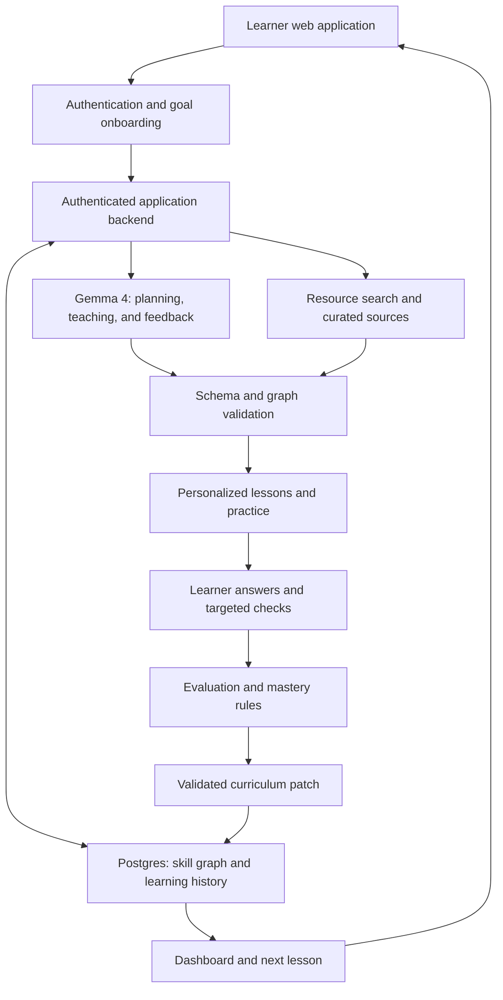

# Cognify by Under Ctrl

> A Gemma 4-powered adaptive learning platform that turns a learner's goal into a personalized course, tracks understanding through a persistent skill graph, and adjusts lessons when knowledge gaps emerge.

**Live Application:** https://cognify-one-tawny.vercel.app

## Team

**Team Name:** Under Ctrl

**College:** Amrita Vishwa Vidyapeetham

| Member | Contribution |
| --- | --- |
| Dalli Krishan Preetham Reddy (Team Leader) | Proposed: product architecture, Gemma integration, and adaptive learning logic |
| Pardheev Vatturu | Proposed: frontend, dashboard, and interactive skill graph |
| Irala Charuhas Reddy | Proposed: authentication, database, and persistence |
| A Prithvi | Proposed: resource retrieval, assessment workflow, and integration testing |

Contributions listed are the team's initial split; edit them to match what each member actually built before submitting.

## Problem Statement

### The Problem

Learners often know what they want to achieve but struggle to identify what they already understand, which prerequisites they lack, and what to study next. Resources are scattered across documentation, tutorials, and courses, making it difficult to assemble an appropriate learning path.

A fixed course can continue even when a learner has not understood a necessary concept. Completing a lesson also does not necessarily demonstrate understanding. When learners struggle, they need specific feedback and targeted practice rather than another generic explanation.

This affects students, self-taught learners, and professionals developing new skills. The challenge is to connect assessment, teaching, practice, and progress into a learning journey that adapts to evidence of understanding.

### Why We Chose This Problem

Education provides a practical setting for combining several AI capabilities: interpreting goals, creating assessments, selecting resources, generating explanations, evaluating responses, and adapting a curriculum.

We chose this problem to help learners move from “I want to learn this” to a clear next step, while making recommendation reasons visible. A six-hour prototype can demonstrate the complete loop through a focused goal such as Python for data analysis.

## Solution

Cognify creates a personalized course from a user's goal and diagnostic answers. Its central component is a persistent skill graph: concepts are nodes, and prerequisite relationships are directed edges.

Gemma 4 interprets the goal, proposes the graph, writes diagnostics, lessons and practice, grades short explanations against stored rubrics, tutors, and proposes adaptations. The application records assessment evidence, updates mastery using explicit rules, and applies validated changes to upcoming lessons. Learners can inspect progress, understand why a concept needs review, and resume their saved course across sessions.

### Key Features

- **Accounts and goal onboarding:** Save goals, experience, daily study time, and preferences.
- **Goal-specific diagnostics:** Ask targeted questions to establish provisional strengths and knowledge gaps.
- **Relevant sources:** Retrieve and organize resources for each skill, with clickable citations and clear provenance.
- **Persistent dynamic skill graph:** Preserve skill identities, prerequisites, mastery evidence, and curriculum changes across sessions.
- **Personalized lessons and quizzes:** Generate explanations, examples, exercises, and assessments matched to current needs.
- **Knowledge-gap detection:** Connect repeated mistakes to possible misconceptions and use targeted checks to confirm prerequisite gaps.
- **Adaptive curriculum:** Insert remedial practice, adjust difficulty, and reorder unfinished lessons when evidence supports a change.
- **Contextual tutor:** Answer questions using the current lesson, relevant sources, and recent learner responses. Questions can be typed or dictated (browser speech recognition; the mic button only appears where the browser supports it).
- **Photo answers:** Short-answer questions accept up to three photos (file picker or pasted screenshot) of handwritten or typeset working, such as a maths derivation. The browser shrinks them, Gemma reads and grades them against the rubric, and only the text and Gemma's transcription are stored, not the images.
- **Maths rendering:** LaTeX in lessons, feedback and tutor replies (`$..$`, `$$..$$`, `\(..\)`, `\[..\]`) is rendered with KaTeX. Model output with LaTeX backslashes is repaired before JSON parsing.
- **At least three sources per lesson:** Each lesson is written from, and lists, three or more sources; the page marks which are cited in the text and which are further reading.
- **Certification suggestion:** A team-curated catalog is matched to the goal by keyword and shown on the Certification page and dashboard. It states no fees or durations and links to each provider; the links were written by the team and have not been checked at runtime.
- **Interface touches:** circular theme-switch reveal (View Transitions API, instant for reduced-motion or unsupported browsers), favicon, copy button on code blocks, Markdown tables, theme switch on mobile.
- **Progress dashboard:** Show completed lessons, assessed and mastered skills, review needs, activity, and the recommended next step.

## Innovation and Differentiation

The differentiator is the connection between assessment evidence and a durable learning structure. The graph records what the learner has attempted and how the course should respond, rather than serving only as a visual roadmap.

1. **Prerequisite-aware adaptation:** Mistakes in an advanced topic prompt targeted prerequisite checks before the platform changes the path.
2. **Visible adaptation reasons:** Curriculum changes record the relevant evidence and a concise explanation the learner can inspect.
3. **Persistent learning history:** Updates preserve completed work, previous attempts, and stable skill identities.

The result is a continuous assessment-and-teaching loop. Learning gains have not been measured; we make no claim of proven effectiveness or uniqueness across existing platforms.

## Technical Implementation

### Architecture

The diagram shows the system and its feedback loop.



### Technology Stack

| Category | Technologies |
| --- | --- |
| Frontend | Next.js 16 (App Router), React 19, TypeScript, Tailwind CSS 4, shadcn/ui-style components on Radix UI primitives, React Flow (`@xyflow/react`), Recharts, lucide-react, KaTeX (maths), browser Web Speech API (voice input), Geist and Bricolage Grotesque fonts; green light and dark themes |
| Backend | Next.js server components and server actions; Zod validation of every form input and every model output |
| Database | Supabase Postgres with row-level security; all privileged writes go through one `sf_commit` function |
| AI / ML | Gemma 4 (`gemma-4-26b-a4b-it`) through the Gemini API, server-side only |
| APIs / Services | Supabase Auth, Gemini API, Tavily search (optional) |
| Testing | Vitest (domain rules and the full learner journey), SQL/RLS checks on Postgres 16 in Docker, Playwright walk-through of the UI |
| Infrastructure | Vercel (app hosting), Supabase (managed Postgres and Auth); runs locally with `npm run dev` / `npm start` |

### Code Map

| Path | What it holds |
| --- | --- |
| `src/lib/domain/` | Pure rules: DAG validation and patching, mastery heuristic, display states, gap detection and remediation planning, citation sanitising |
| `src/lib/ai/` | Gemma client (`gemma.ts`), Zod schemas for the 8 tasks, task prompts (`tasks.ts`), and the sample course used in fixture mode |
| `src/lib/search.ts` | Tavily search and the curated catalog of docs.python.org and pandas links |
| `src/lib/db/store.ts` | Supabase store (RLS reads, `sf_commit` writes) and the local JSON demo store |
| `src/lib/services/` | The learner journey: onboarding, resumable setup, lessons, hints, tutor, grading, adaptation, dashboard stats |
| `src/app/` | Pages: landing, auth, onboarding, setup, assessment, lesson, skill map, course, dashboard, resources, settings |
| `supabase/migrations/` | Tables, RLS policies, grants and `sf_commit` |
| `supabase/tests/`, `scripts/test-sql.sh` | Two-user RLS checks |
| `tests/` | Domain tests and the end-to-end journey test |
| `scripts/seed-demo.mts` | Seeds the demo learner |
| `docs/` | Build brief, [demo script](docs/demo-script.md), [walkthrough](docs/walkthrough.md), [two-user auth checklist](docs/auth-checklist.md) |

### How It Works

1. **Define the goal:** The learner creates an account and provides a goal, experience level, and study time.
2. **Assess the starting point:** Gemma generates diagnostic questions. Multiple-choice answers are graded deterministically; short explanations are evaluated against stored rubrics.
3. **Create the course:** The backend validates and saves a prerequisite graph, associates sources with skills, and generates the first lesson.
4. **Teach and practice:** The learner studies, asks the contextual tutor for help, and submits practice answers.
5. **Update understanding:** Assessment evidence updates mastery. Lesson completion and skill mastery remain separate.
6. **Adapt the path:** Repeated related mistakes trigger targeted checks. Confirmed gaps can add remediation or modify unfinished lessons, with a visible explanation.
7. **Resume learning:** The dashboard recommends the next lesson from the saved graph and progress.

For example, picking "10 20 30" for `for i in range(len(nums)): print(i)` and a similar answer in loops practice points twice at the *value-as-index* misconception, which belongs to list indexing. Cognify asks two indexing questions; if they confirm the gap, a review node is inserted before Loops, the loops lesson is simplified, and follow-up questions decide when the review is resolved. Earlier attempts and completed work remain available.

### Scoring Heuristic

Transparent rules in `src/lib/domain/mastery.ts` and `adaptation.ts`. They are a heuristic, not a validated psychometric model.

- **Answer score `r`:** MCQ is 1 or 0. Short answers get the fraction of rubric points Gemma marks as met (fixture mode uses keyword matching). A hint multiplies `r` by 0.7.
- **Mastery estimate `m`:** the first answer sets `m = r`; each later one gives `m = 0.7·m + 0.3·r`. Only answers that directly test a skill count as evidence.
- **Mastered:** `m ≥ 0.8` with at least 3 answers, 2 of them correct without hints.
- **Ready (unlocks dependents):** `m ≥ 0.65` with at least 2 answers, or an explicit learner override (recorded).
- **Unassessed** skills have no score and are never treated as failures; fewer than 3 answers is shown as provisional.
- **Gap suspected:** 2 or more low answers carrying a misconception code that points at the same other skill → a 2-question targeted check on that skill.
- **Gap confirmed:** check mean below 0.6 → one remediation node, edge into the dependent skill, simplified dependent lesson, scheduled follow-up. An open remediation for the same gap is reused, never duplicated.
- **Review resolved:** follow-up mean of 0.8 or more.


### Technical Decisions

- **Relational graph storage:** Save skills and prerequisite edges in Postgres to simplify deployment and persistence.
- **Directed acyclic graph:** Support multiple prerequisites per skill and reject cycles before saving changes.
- **Stable IDs and versioned patches:** Update the existing graph incrementally and retain assessment and adaptation history.
- **Transparent mastery rules:** Use scored answers and independent follow-up evidence. Treat unassessed skills as unknown and limited evidence as provisional.
- **Backend-controlled updates:** Validate Gemma proposals; application code controls authorization, grading rules, graph changes, and persistence.
- **Source-backed generation:** Provide retrieved excerpts and allow citations only to known source IDs. Label curated fallback resources explicitly.
- **On-demand content:** Generate upcoming lessons as needed and cache results to reduce latency and model calls.
- **Retry-safe persistence:** Use unique submission keys and graph-version checks to prevent duplicate grades or remediation nodes.
- **Private learner state:** Use ownership checks and row-level security; keep answer keys and API secrets inaccessible to ordinary browser reads.

## Implementation During the Hackathon

Everything in `src/`, `supabase/`, `tests/` and `scripts/` was written on Hack Day (2026-10-08), following the build brief in `docs/Project-Deliverables.txt`. The git history shows the order:

1. Domain rules with unit tests: DAG validation, mastery, display states, adaptation.
2. Gemma task layer with Zod schemas and one repair attempt; curated resource catalog and Tavily search; Supabase schema with RLS and the `sf_commit` function, checked on Postgres.
3. Data stores, authentication, and the learning services, with an end-to-end journey test.
4. The web interface: onboarding, resumable setup, assessments, lesson workspace with tutor, skill map, dashboard, resources, settings.
5. Seed script, demo docs, fixes from live Gemma runs, layout polish.

### What is verified and what is not

| Item | Status |
| --- | --- |
| Domain rules; journey (diagnostic → mistake → check → remediation → follow-up); duplicate submissions; second-user isolation | `npm test` passes (local store, fixture content) |
| RLS and `sf_commit` | `scripts/test-sql.sh` passes on Postgres 16 with a Supabase auth stub |
| Production build and lint | `npm run build` and `npm run lint` pass |
| UI journey | Walked through in Chromium with Playwright in fixture/local mode |
| Live Gemma 4 (`gemma-4-26b-a4b-it`) | A full live run with the team key (local store, curated sources) completed: goal → graph → both diagnostics → short-answer grading → sources → first lesson with citations → tutor reply → graded practice, in about 2.5 minutes. The parsing fixes listed under Challenges came from these runs. The live adaptation path (check and remediation) is covered by tests with sample content, not yet by a live run |
| Supabase Auth and Postgres in a real project | Not yet run: the build container could not reach supabase.co. Apply the migration and follow [the auth checklist](docs/auth-checklist.md) |
| Tavily live search | Not yet run for the same reason; the curated catalog is used without a key |
| Voice input, photo answers, KaTeX, certification page, theme reveal | Build, lint and unit tests pass; the page, theme reveal and mic button were checked in Chromium in fixture mode. Photo grading and dictation have not been run against live Gemma or a real microphone, and it is not confirmed that the hosted Gemma model reads images |
| Deployment, demo video | Uploaded |

### What is fixture-only or unfinished

- **Fixture mode** (no `GEMINI_API_KEY`, or `COGNIFY_FIXTURE_MODE=1`): a hand-written 14-skill Python course, question bank, keyword grader and canned tutor replies. A banner labels it "Sample content"; it never pretends to be Gemma.
- **Local demo store** (no Supabase URL): a JSON file in `.data/` with scrypt-hashed passwords. Labeled in the UI; for demos only, not for real users.
- **Curated catalog** (no Tavily key): team-written summaries of docs.python.org and pandas pages, labeled "curated".
- Not built: spaced-repetition scheduling, multiple languages, instructor views, email reminders, deployment.

### Team Contributions

- **Dalli Krishan Preetham Reddy (Leader):** Planned: architecture, Gemma integration, and adaptation logic. Actual contribution pending confirmation.
- **Pardheev Vatturu:** Planned: frontend, dashboard, and skill graph. Actual contribution pending confirmation.
- **Irala Charuhas Reddy:** Planned: authentication, schema, and learner-state persistence. Actual contribution pending confirmation.
- **A Prithvi:** Planned: source retrieval, assessments, and integration testing. Actual contribution pending confirmation.

## Working Application

**Live Application:** https://cognify-one-tawny.vercel.app (Vercel)

Test flow: account creation → goal → diagnostic → skill graph → lesson and quiz → targeted remediation → updated dashboard. Refreshing and signing back in preserves the course and progress. See [docs/walkthrough.md](docs/walkthrough.md).

## Demo Video

**Demo Video:**  Recorded and uploaded (https://youtu.be/flDt4K88ybY).

The 90-second script is in [docs/demo-script.md](docs/demo-script.md): a Python data-analysis goal, diagnostic-generated graph, lesson sources, an indexing-related mistake, a targeted prerequisite check, the remediation and its reason, a follow-up, and a refresh to show persistence. It has separate seeded and fresh-account paths; seeded data is sample content and is labeled as such.

## Open Source and AI Usage

### AI / Models

- **Gemma 4 (`gemma-4-26b-a4b-it`)**, Google, via the Gemini API: the only model the app calls at runtime. Used for goal interpretation, skill-graph proposals, diagnostic and practice questions, ranking search results, lesson writing, short-answer grading against rubrics, the tutor, and adaptation rationales. Every reply is parsed as JSON, validated with Zod, repaired at most once, and checked again against stored data (known skill IDs, known source IDs, DAG rules) before anything is saved. Grading rules, mastery updates and graph changes are decided by application code, not by the model. `GEMMA_MODEL` must start with `gemma-`; the app refuses other models.
- **Claude (Claude Code):** development assistant used by the team to help write code and documentation during the event. It is not part of the running application.

### Open Source Components

| Component | Role | License |
| --- | --- | --- |
| Next.js, React | Web framework and UI | MIT |
| TypeScript | Type checking | Apache-2.0 |
| Tailwind CSS | Styling | MIT |
| React Flow (`@xyflow/react`) | Skill graph rendering | MIT |
| Recharts | Dashboard charts | MIT |
| KaTeX | Rendering LaTeX maths | MIT |
| Zod | Input and model-output validation | MIT |
| `@supabase/supabase-js`, `@supabase/ssr` | Auth and database client | MIT |
| lucide-react | Icons | ISC |
| shadcn/ui patterns, Radix UI primitives, class-variance-authority, clsx, tailwind-merge | UI components (written into `src/components/ui/`) | MIT |
| Bricolage Grotesque (via `@fontsource-variable`) | Display font | SIL OFL 1.1 |
| Geist | Font | SIL OFL 1.1 |
| Vitest, tsx, ESLint | Tests, scripts, linting | MIT |

- **Services:** Supabase (Auth, Postgres), Gemini API (Gemma 4 inference), Tavily (optional web search), each under its provider's terms.
- **Gemma 4** is used under the [Gemma terms of use](https://ai.google.dev/gemma/terms).
- **Learning resources:** the curated catalog links to docs.python.org and pandas.pydata.org. Summaries are written by the team; the app links to the originals and does not copy them.
- **Dataset:** none. The app uses learner responses and retrieved or curated resources.

## Setup and Usage

### Prerequisites

- Node.js 20.9 or newer (built and tested with Node 22) and npm.
- Optional for full mode: a Supabase project, a Gemini API key, a Tavily key. Without them the app still runs in clearly labeled demo mode.

### Installation

```bash
git clone https://github.com/p-art-dheev/Under-Ctrl.git
cd Under-Ctrl
npm install
cp .env.example .env
```

### Environment Variables and Where Keys Come From

Fill in `.env` (never commit it; it is gitignored). Every variable is listed in `.env.example`.

| Variable | Where to get it | Without it |
| --- | --- | --- |
| `GEMINI_API_KEY` | [Google AI Studio](https://aistudio.google.com/apikey) → Create API key | Fixture content (labeled "Sample content") |
| `GEMMA_MODEL` | Default `gemma-4-26b-a4b-it`; `gemma-4-31b-it` also documented | Default is used |
| `TAVILY_API_KEY` | [app.tavily.com](https://app.tavily.com) → API keys | Curated catalog (labeled "curated") |
| `NEXT_PUBLIC_SUPABASE_URL`, `NEXT_PUBLIC_SUPABASE_ANON_KEY` | Supabase dashboard → Project Settings → API | Local demo store in `.data/` (labeled) |
| `SUPABASE_SERVICE_ROLE_KEY` | Same page, `service_role` key. Server-only; used only for `sf_commit` and answer keys | Required whenever the Supabase URL is set |
| `COGNIFY_FIXTURE_MODE` | Set to `1` to force sample content even with a Gemini key | Leave empty for live Gemma |

### Supabase Setup

1. Supabase dashboard → **SQL Editor** → **New query**, paste `supabase/migrations/20261008000000_cognify.sql`, **Run** (once).
2. **Authentication → URL Configuration:** add `http://localhost:3000/auth/confirm` (and any deployed URL) to the redirect URLs.
3. Optional for demos: **Authentication → Sign In / Providers → Email**, turn off **Confirm email**.

### Running the Project

```bash
npm run dev                # http://localhost:3000
npm test                   # domain + journey tests (no network)
npm run lint
npm run build && npm start
npm run seed               # demo learner; see docs/demo-script.md
bash scripts/test-sql.sh   # RLS checks (needs Docker)
```

**Settings → Developer status** shows which mode each part runs in and can run a one-call Gemma check.

### Deploying on Vercel

1. Import the GitHub repository as a Next.js project (no build settings to change).
2. **Settings → Environment Variables:** add the Gemma, Tavily and all three Supabase variables from the table above. Supabase is required on Vercel, because the local JSON store cannot write to a serverless filesystem. Leave `COGNIFY_FIXTURE_MODE` unset for live Gemma.
3. Redeploy so the variables take effect.
4. In Supabase **Authentication → URL Configuration**, set the Site URL to the Vercel domain and add `https://<your-domain>/auth/confirm` to the redirect URLs.

### Usage

1. Create an account or sign in.
2. Enter a learning goal, experience, daily study time and explanation style.
3. Let setup build the graph, then complete both diagnostic batches.
4. Explore the skill map and open the recommended lesson.
5. Read the cited sources, ask the tutor for help, and answer the practice questions.
6. Take any targeted check; work through a review node if one is inserted.
7. Inspect progress, "Your path changed" and the next step on the dashboard.

## Challenges and Learnings

### Challenges

- **Model output that almost fits the schema:** live Gemma replies put code fences inside question text and quoted option numbers (`"2"`). We extract the outermost JSON object first, accept quoted numbers and option letters, validate with Zod, and allow one repair round that sends back the exact validation errors.
- **Overreacting to one mistake:** a single wrong answer never changes the path; two answers sharing a misconception trigger a check, and only a failed check inserts remediation.
- **Keeping history through graph changes:** skills keep stable IDs, every change is a versioned patch applied inside one database transaction, and retries are made safe with idempotency keys. A bug where a learner's second course reused the first course's setup keys was caught by the seed script and fixed.
- **Grades the browser cannot forge:** learners read only their own rows and cannot write grades, mastery or graph rows; answer keys are not readable from the browser at all.
- **Six-hour deadline:** we built one complete journey end to end and generate lessons on demand instead of up front.

### Learnings

- Keeping the model on proposals and the code on decisions made the adaptation logic testable without network calls.
- Separating activity completion from demonstrated understanding changes what a dashboard can honestly show.
- A labeled fixture mode let us build and test the whole journey before keys and network access were available.

## Devpost Submission

**Devpost Project:** Pending submission.

Add the completed Devpost project URL with team details, the working application, demo video, implementation information, and acknowledgements.

## Credits and License

### Credits

- **Under Ctrl team:** Dalli Krishan Preetham Reddy, Pardheev Vatturu, Irala Charuhas Reddy, and A Prithvi.
- **Google / Gemma:** Gemma 4 is the runtime model. See the [Gemma 4 model card](https://ai.google.dev/gemma/docs/core/model_card_4) and [hosted Gemma documentation](https://ai.google.dev/gemma/docs/core/gemma_on_gemini_api).
- **Open-source maintainers:** see the table under Open Source Components.
- **Educational resource authors:** Preserve source links and attribution for learning materials.
- **AI development assistance:** Claude (Claude Code) was used as a coding assistant.

### License

**Project license:** [MIT License](LICENSE), Copyright (c) 2026 Under Ctrl. Add the `LICENSE` file shipped alongside this README to the repository root.

Third-party libraries, fonts, models and learning resources keep their own licenses and terms (see Open Source Components above). Gemma 4 is used under the [Gemma terms of use](https://ai.google.dev/gemma/terms).

## Submission Checklist

- [x] Project title and description added
- [x] All team members listed
- [x] Problem clearly explained
- [x] Reason for choosing the problem explained
- [x] Solution and key features documented
- [x] Innovation and differentiation explained
- [x] Architecture included
- [x] Technical implementation documented
- [x] Work completed during the hackathon documented
- [x] Team contributions documented
- [x] Working application is functional
- [x] Live application link added where applicable
- [x] Demo video added
- [x] AI and open-source components documented
- [x] Setup and usage instructions tested
- [x] Challenges and learnings documented
- [x] Devpost submission completed
- [x] Devpost link added
- [x] Credits added
- [x] License added
- [x] Repository is organized and complete
