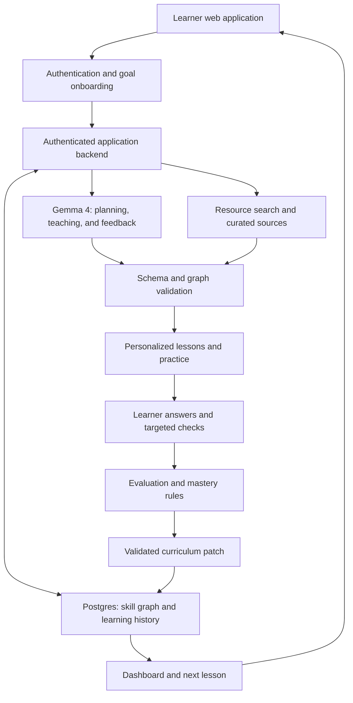

# Under-Ctrl

> A Gemma 4-powered adaptive learning platform that turns a learner's goal into a personalized course, tracks understanding through a persistent skill graph, and adjusts lessons when knowledge gaps emerge.

**Status:** Project design draft. Implementation, deployment, test results, and individual contributions have not yet been confirmed. This README describes the proposed product and marks submission details as pending.

## Team

**Team Name:** Under Ctrl

**College:** Amrita Vishwa Vidyapeetham

| Member | Role | Contribution |
| --- | --- | --- |
| Dalli Krishan Preetham Reddy | Team Leader | Proposed: product architecture, Gemma integration, and adaptive learning logic |
| Pardheev Vatturu | Team Member | Proposed: frontend, dashboard, and interactive skill graph |
| Irala Charuhas Reddy | Team Member | Proposed: authentication, database, and persistence |
| A Prithvi | Team Member | Proposed: resource retrieval, assessment workflow, and integration testing |

Contribution assignments are suggestions; replace them with actual contributions before submission.

## Problem Statement

### The Problem

Learners often know what they want to achieve but struggle to identify what they already understand, which prerequisites they lack, and what to study next. Resources are scattered across documentation, tutorials, and courses, making it difficult to assemble an appropriate learning path.

A fixed course can continue even when a learner has not understood a necessary concept. Completing a lesson also does not necessarily demonstrate understanding. When learners struggle, they need specific feedback and targeted practice rather than another generic explanation.

This affects students, self-taught learners, and professionals developing new skills. The challenge is to connect assessment, teaching, practice, and progress into a learning journey that adapts to evidence of understanding.

### Why We Chose This Problem

Education provides a practical setting for combining several AI capabilities: interpreting goals, creating assessments, selecting resources, generating explanations, evaluating responses, and adapting a curriculum.

We chose this problem to help learners move from “I want to learn this” to a clear next step, while making recommendation reasons visible. A six-hour prototype can demonstrate the complete loop through a focused goal such as Python for data analysis.

## Solution

Under-Ctrl is designed to create a personalized course from a user's goal and diagnostic answers. Its central component is a persistent skill graph: concepts are nodes, and prerequisite relationships are directed edges.

Gemma 4 helps generate lessons, evaluate explanations, and suggest likely misconceptions. The application records assessment evidence, updates mastery using explicit rules, and applies validated changes to upcoming lessons. Learners can inspect progress, understand why a concept needs review, and resume their saved course across sessions.

### Key Features

- **Accounts and goal onboarding:** Save goals, experience, daily study time, and preferences.
- **Goal-specific diagnostics:** Ask targeted questions to establish provisional strengths and knowledge gaps.
- **Relevant sources:** Retrieve and organize resources for each skill, with clickable citations and clear provenance.
- **Persistent dynamic skill graph:** Preserve skill identities, prerequisites, mastery evidence, and curriculum changes across sessions.
- **Personalized lessons and quizzes:** Generate explanations, examples, exercises, and assessments matched to current needs.
- **Knowledge-gap detection:** Connect repeated mistakes to possible misconceptions and use targeted checks to confirm prerequisite gaps.
- **Adaptive curriculum:** Insert remedial practice, adjust difficulty, and reorder unfinished lessons when evidence supports a change.
- **Contextual tutor:** Answer questions using the current lesson, relevant sources, and recent learner responses.
- **Progress dashboard:** Show completed lessons, assessed and mastered skills, review needs, activity, and the recommended next step.

## Innovation and Differentiation

The proposed differentiator is the connection between assessment evidence and a durable learning structure. The graph records what the learner has attempted and how the course should respond, rather than serving only as a visual roadmap.

1. **Prerequisite-aware adaptation:** Mistakes in an advanced topic prompt targeted prerequisite checks before the platform changes the path.
2. **Visible adaptation reasons:** Curriculum changes record the relevant evidence and a concise explanation the learner can inspect.
3. **Persistent learning history:** Updates preserve completed work, previous attempts, and stable skill identities.

The intended result is a continuous assessment-and-teaching loop. Learning gains and comparative advantages remain to be evaluated; this draft does not claim proven effectiveness or uniqueness across all existing platforms.

## Technical Implementation

### Architecture

The diagram shows the proposed system and feedback loop.



### Technology Stack

No implementation has been supplied for verification. Categories therefore list `N/A` for confirmed implementation and identify the planned choices.

| Category | Technologies |
| --- | --- |
| Frontend | N/A — planned: Next.js, React, TypeScript, Tailwind CSS, React Flow, Recharts |
| Backend | N/A — planned: Next.js server routes/actions and Zod validation |
| Database | N/A — planned: Supabase Postgres with row-level security |
| AI / ML | N/A — planned: Gemma 4 through a configurable server-side adapter |
| Infrastructure | N/A — hosting and deployment not yet confirmed |
| APIs / Services | N/A — planned: Supabase Auth, hosted Gemma inference through the Gemini API, Tavily search |

Replace these entries with technologies actually implemented before submission.

### How It Works

1. **Define the goal:** The learner creates an account and provides a goal, experience level, and study time.
2. **Assess the starting point:** Gemma generates diagnostic questions. Multiple-choice answers are graded deterministically; short explanations are evaluated against stored rubrics.
3. **Create the course:** The backend validates and saves a prerequisite graph, associates sources with skills, and generates the first lesson.
4. **Teach and practice:** The learner studies, asks the contextual tutor for help, and submits practice answers.
5. **Update understanding:** Assessment evidence updates mastery. Lesson completion and skill mastery remain separate.
6. **Adapt the path:** Repeated related mistakes trigger targeted checks. Confirmed gaps can add remediation or modify unfinished lessons, with a visible explanation.
7. **Resume learning:** The dashboard recommends the next lesson from the saved graph and progress.

For example, difficulty with nested loops may lead to an indexing check. If it confirms a gap, indexing practice is scheduled before the next dependent lesson. Earlier attempts and completed work remain available.

### Technical Decisions

- **Relational graph storage:** Save skills and prerequisite edges in Postgres to simplify deployment and persistence.
- **Directed acyclic graph:** Support multiple prerequisites per skill and reject cycles before saving changes.
- **Stable IDs and versioned patches:** Update the existing graph incrementally and retain assessment and adaptation history.
- **Transparent mastery rules:** Use scored answers and independent follow-up evidence. Treat unassessed skills as unknown and limited evidence as provisional.
- **Backend-controlled updates:** Validate Gemma proposals; application code controls authorization, grading rules, graph changes, and persistence.
- **Source-backed generation:** Provide retrieved excerpts and allow citations only to known source IDs. Label curated fallback resources explicitly.
- **On-demand content:** Generate upcoming lessons as needed and cache results to reduce latency and model calls.
- **Retry-safe persistence:** Use unique submission keys and graph-version checks to prevent duplicate grades or remediation nodes.
- **Private learner state:** Use ownership checks and row-level security; keep answer keys and API secrets inaccessible to ordinary browser reads.

## Implementation During the Hackathon

**Confirmed completed work:** N/A — the available material defines the product and build plan; a working application has not been provided for verification.

| Time | Planned work |
| --- | --- |
| 0:00–0:45 | Scaffold, database, authentication, and a live Gemma connection check |
| 0:45–1:45 | Goal onboarding, diagnostics, and persistent graph creation |
| 1:45–2:45 | Resource retrieval, graph visualization, and the first lesson |
| 2:45–4:00 | Assessments, mastery updates, targeted checks, and remediation |
| 4:00–5:00 | Dashboard, contextual tutor, and adaptation explanations |
| 5:00–6:00 | Integration checks, persistence verification, demo preparation, and polish |

Update this section after Hack Day with completed functionality, actual test results, and remaining limitations.

### Team Contributions

- **Dalli Krishan Preetham Reddy (Leader):** Proposed: architecture, Gemma integration, and adaptation logic. Actual contribution pending confirmation.
- **Pardheev Vatturu:** Proposed: frontend, dashboard, and skill graph. Actual contribution pending confirmation.
- **Irala Charuhas Reddy:** Proposed: authentication, schema, and learner-state persistence. Actual contribution pending confirmation.
- **A Prithvi:** Proposed: source retrieval, assessments, and integration testing. Actual contribution pending confirmation.

## Working Application

**Live Application:** Pending deployment.

The intended test flow is account creation → goal → diagnostic → skill graph → lesson and quiz → targeted remediation → updated dashboard. Refreshing and signing back in should preserve the course and progress.

Add the functional deployment URL and required access instructions once verified.

## Demo Video

**Demo Video:** Pending recording and upload.

The planned demonstration covers a Python data-analysis goal, diagnostic-generated graph, lesson sources, an indexing-related mistake, a targeted prerequisite check, and a visible curriculum change. It ends with a follow-up assessment and refresh to demonstrate persistence.

Label seeded demo data clearly and distinguish it from a fresh-account walkthrough.

## Open Source and AI Usage

### AI / Models

- **Gemma 4:** Planned runtime model for goal interpretation, diagnostics, curriculum proposals, explanations, short-answer feedback, tutoring, and adaptation rationales.
- **Claude Pro:** Intended development assistant using the project build prompt. Record actual development assistance before submission; Claude is not the proposed runtime model.

Planned hosted model: `gemma-4-26b-a4b-it`. Verify availability in the provider account and document the exact model used in the final implementation.

### Open Source Components

- **Next.js and React:** Planned web application and component framework.
- **TypeScript and Tailwind CSS:** Planned type checking and styling.
- **React Flow:** Planned interactive graph rendering.
- **Recharts:** Planned dashboard charts.
- **Zod:** Planned request and AI-output validation.
- **Supabase:** Planned authentication and Postgres persistence.
- **Dataset:** N/A — no external training dataset is specified. The MVP uses learner responses and retrieved or curated resources.
- **API / Service:** Planned hosted Gemma inference and Tavily search.

Retain required notices for the exact dependency versions used. Cite educational resources and respect their permissions. Document applicable model licensing, provider terms, and content attribution in the final repository.

## Setup and Usage

These are proposed steps for the planned Next.js implementation. Repository structure, package scripts, and commands have not yet been tested.

### Prerequisites

- Node.js compatible with the implemented Next.js release, and npm.
- A Supabase project with authentication configured and migrations applied.
- Hosted Gemma 4 access and an API key.
- A Tavily key for live search, or an explicitly labeled curated catalog.
- The source repository and `.env.example` file.

### Installation

Replace the URL and directory with the final project details.

```bash
git clone <repository-url>
cd <project-directory>
npm install
```

Apply the project's SQL migrations to Supabase, configure authentication callback URLs, and enable row-level security policies. Add exact migration instructions when the repository structure is finalized.

### Environment Variables

Create `.env.local` from `.env.example` and provide:

```env
NEXT_PUBLIC_SUPABASE_URL=https://your-project.supabase.co
NEXT_PUBLIC_SUPABASE_ANON_KEY=your-supabase-public-anon-key
GEMINI_API_KEY=your-server-side-api-key
GEMMA_MODEL=gemma-4-26b-a4b-it
TAVILY_API_KEY=your-server-side-search-api-key
```

Keep inference and search credentials on the server. The public Supabase client key must be used with authentication and row-level security; ordinary users must not directly edit grading or mastery records.

### Running the Project

Expected development command, subject to the final package scripts:

```bash
npm run dev
```

Open the URL printed by the server. Verify authentication, model access, and database connectivity. Document actual build and test commands after implementation.

### Usage

1. Create an account or sign in.
2. Enter a learning goal and daily study time.
3. Complete the initial diagnostic.
4. Explore the skill graph and open the recommended lesson.
5. Review sources, ask the tutor for help, and complete practice questions.
6. Complete suggested targeted checks or remediation.
7. Inspect progress, adaptation reasons, and the next lesson on the dashboard.

## Challenges and Learnings

### Challenges

Actual development challenges have not yet been recorded. Anticipated challenges and planned responses include:

- **Unreliable model output:** Schema validation and a bounded repair attempt.
- **Overreacting to one mistake:** Repeated evidence and targeted prerequisite checks before major changes.
- **Lost history during updates:** Stable IDs, graph versions, and incremental patches.
- **Unsupported citations:** References restricted to stored retrieved or curated sources.
- **Six-hour deadline:** One complete learner journey and on-demand lesson generation.

### Learnings

Actual development learnings are pending. The project is designed to explore:

- Connecting assessment, tutoring, and planning through persistent learner state.
- Separating activity completion from demonstrated understanding.
- Combining generated proposals with deterministic validation and updates.
- Explaining learning recommendations using concrete assessment evidence.

Replace anticipated items with actual challenges, solutions, and observations after the event.

## Devpost Submission

**Devpost Project:** Pending submission.

Add the completed Devpost project URL with team details, the working application, demo video, implementation information, and acknowledgements.

## Credits and License

### Credits

- **Under Ctrl team:** Dalli Krishan Preetham Reddy, Pardheev Vatturu, Irala Charuhas Reddy, and A Prithvi.
- **Google / Gemma:** Planned integration. See the [Gemma 4 model card](https://ai.google.dev/gemma/docs/core/model_card_4) and [hosted Gemma documentation](https://ai.google.dev/gemma/docs/core/gemma_on_gemini_api).
- **Open-source maintainers:** Credit the libraries actually used and preserve applicable notices.
- **Educational resource authors:** Preserve source links and attribution for learning materials.
- **AI development assistance:** Record tools actually used to generate or edit code and documentation.

### License

**Project license:** Not yet specified. Select a license and add its text in a `LICENSE` file before claiming the repository is licensed for reuse. Third-party components and learning resources retain their respective licenses and terms.

## Submission Checklist

- [x] Project title and description added
- [x] All team members listed
- [x] Problem clearly explained
- [x] Reason for choosing the problem explained
- [x] Solution and key features documented
- [x] Innovation and differentiation explained
- [x] Architecture included
- [ ] Technical implementation documented
- [ ] Work completed during the hackathon documented
- [ ] Team contributions documented
- [ ] Working application is functional
- [ ] Live application link added where applicable
- [ ] Demo video added
- [ ] AI and open-source components documented
- [ ] Setup and usage instructions tested
- [ ] Challenges and learnings documented
- [ ] Devpost submission completed
- [ ] Devpost link added
- [ ] Credits added
- [ ] License added
- [ ] Repository is organized and complete
